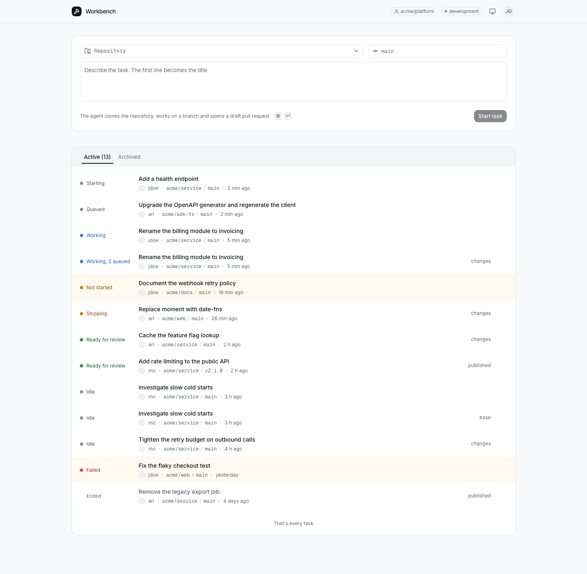

# OpenComputer workbench

A small coding workbench: choose a repository and a base revision, hand an
agent a task, leave, and come back to a tested branch and a draft pull
request. Send a follow-up or stop a turn from any browser. The web application
is one React page and a handful of authenticated routes that run unchanged on
Cloudflare Workers and Vercel. It keeps no datastore, queue or background
worker of its own: every task is one
[OpenComputer Serverless Agents](https://docs.opencomputer.dev/agents/overview)
session, GitHub holds the code and the review, and a fresh deployment of the
application finds every task where it was left.



## Run it locally

You need Node.js 22, an OpenComputer account and a GitHub OAuth app for
sign-in; [Access](#access) covers the two GitHub registrations.

```sh
git clone https://github.com/diggerhq/opencomputer-workbench.git && cd opencomputer-workbench
npm ci
npx opencomputer login
npm run deploy:agents
npm run dev
```

`npm run deploy:agents` links or creates the OpenComputer project and deploys
the worker agent to its development environment; the project id and agent id
it records in `.opencomputer/project.json` go into `.env.local` with the rest
of [Configuration](#configuration) before `npm run dev`. Then open
http://localhost:3200 and sign in with GitHub.

## Deploy

[](https://deploy.workers.cloudflare.com/?url=https://github.com/diggerhq/opencomputer-workbench)
[](https://vercel.com/new/clone?repository-url=https%3A%2F%2Fgithub.com%2Fdiggerhq%2Fopencomputer-workbench&env=OPENCOMPUTER_API_KEY,OPENCOMPUTER_PROJECT_ID,OPENCOMPUTER_ENVIRONMENT,OPENCOMPUTER_AGENT_ID,GITHUB_CLIENT_ID,GITHUB_CLIENT_SECRET,WORKBENCH_COOKIE_KEY,WORKBENCH_MEMBERSHIP,WORKBENCH_ORIGIN)

Workers serves the page as static assets and runs the routes in one Worker,
with the configuration as Worker secrets (`wrangler.jsonc`). Vercel serves the
page from `dist/client` and runs the same routes as one function behind the
rewrites in `vercel.json`, with the configuration in the project's environment
variables. Neither host needs a database, a queue or a schedule. Set
`WORKBENCH_ORIGIN` to the URL the host gives you and register that origin's
`/auth/callback` on the OAuth app.

## How it works

- **The agent is one file and one tool.** `opencomputer/agents/worker/agent.ts` declares a GitHub connection, a model and the `report` tool; cloning, editing, running checks, pushing and opening the pull request are the OpenComputer harness and the managed GitHub connection. The tool (`opencomputer/agents/worker/tools/report.ts`) verifies what the agent claims against GitHub before it returns.
- **Starting work is two documented calls.** `POST /api/tasks` in `src/server/tasks.ts` creates a session carrying the task's labels and admits its first turn, both under the id the composer minted, so a lost reply is retried without a second task.
- **The browser attaches with the official hook.** `useAgent` from `@opencomputer/react` reads the session's event log through the three routes in `src/server/session-proxy.ts`, which check that the session belongs to this workbench and forward the rest unchanged.
- **The list is one OpenComputer call per page and one pure function.** `GET /api/tasks` lists the project's sessions with their labels and results; `toTask` in `src/server/task.ts` turns each row into a task's execution, archive and result facets.
- **The task page is the event log.** The request, the tool activity, the result card and the conversation are reduced from the session's events (`src/app/reducer.ts`), so a page reopened during a turn shows the turn in progress.
- **Redeploy on either host from a fresh browser and see the same work.** Nothing lives in the application process: `wrangler.jsonc` and `vercel.json` declare no persistence, and `test/stateless.test.ts` checks that they never do.

## Configuration

Every variable is read at startup; a missing one names itself and stops the
application. Locally they live in `.env.local` for the Vite dev server and in
`.dev.vars` for `npx wrangler dev`; on Workers they are Worker secrets; on
Vercel they are the project's environment variables. Neither file is committed.

| Variable | Meaning |
| --- | --- |
| `OPENCOMPUTER_API_KEY` | Your organization API key; the server is its only holder |
| `OPENCOMPUTER_PROJECT_ID` | The project the workbench is scoped to, from `.opencomputer/project.json` |
| `OPENCOMPUTER_ENVIRONMENT` | `development` or `production`: the environment the workbench uses |
| `OPENCOMPUTER_AGENT_ID` | The worker agent's id in that project, from `.opencomputer/project.json` |
| `OPENCOMPUTER_API_URL` | Optional; the OpenComputer origin, default `https://app.opencomputer.dev` |
| `GITHUB_CLIENT_ID`, `GITHUB_CLIENT_SECRET` | The GitHub OAuth app used for sign-in |
| `WORKBENCH_COOKIE_KEY` | Base64 of 32 random bytes (`openssl rand -base64 32`); rotating it signs everyone out |
| `WORKBENCH_MEMBERSHIP` | Who may sign in: `org:<id>`, `team:<org id>/<team id>` or `user:<id>` |
| `WORKBENCH_ORIGIN` | The application's public origin; the OAuth callback is `<origin>/auth/callback` |

## Development

- `npm run check` runs the typecheck of the application and of the agent directory, the linter, the unit tests and the build. CI runs the same on every pull request and builds preview deployments on both hosts when the host tokens are configured as repository secrets.
- `npm run doctor` checks the agent directory with the OpenComputer CLI; `npm run deploy:agents` deploys the worker to the linked project's development environment.
- `npm run dev:fixtures` runs the application over the recorded fixtures and opens a browser already signed in, so every screen and state can be looked at without an OpenComputer project or a GitHub app (`npx playwright install chromium` once).
- `fixtures/rows/` holds one session row per task state and `fixtures/logs/` one event log per scenario. The projection, the reducer and the components are tested over them, so every state renders without a live run; each directory's README says what its files are and how they are refreshed.

## Access

Sign-in is GitHub OAuth. Register an OAuth app whose callback URL is
`<origin>/auth/callback` and put its client id and secret in the
configuration. The application asks for the `read:org` scope and keeps the
token only to re-check membership. The membership rule names one organization,
team or user by its numeric GitHub id; `npm run membership-id -- team:<org>/<slug>`
(or `org:<login>`, `user:<login>`) resolves the name once with the GitHub CLI
and prints the `WORKBENCH_MEMBERSHIP` line. Members share every task and every
connected repository; there are no roles.

The agent's repository access is separate from sign-in. Open the project in
the OpenComputer dashboard, choose GitHub, install the OpenComputer GitHub App
on the account and select the repositories the agent may clone and push to,
then attach the installation to the environment the workbench uses. That
selection is the whole boundary: the workbench offers exactly those
repositories, and commits and pull requests are authored by the App with the
requester credited.

The session cookie is encrypted, bound to this workbench's configuration,
expires 24 hours after sign-in and re-checks membership every hour, so a
member removed from the team is signed out within the hour. Rotating
`WORKBENCH_COOKIE_KEY` signs everyone out at once.

## Known platform gaps

- `src/server/oc.ts` is a thin fetch wrapper over the management API; it goes when the OpenComputer SDK ships a portable client for it.
- `src/app/reducer.ts` reduces the session's events into tool activity and results; it goes when the React hook exposes turns with their tool calls.
