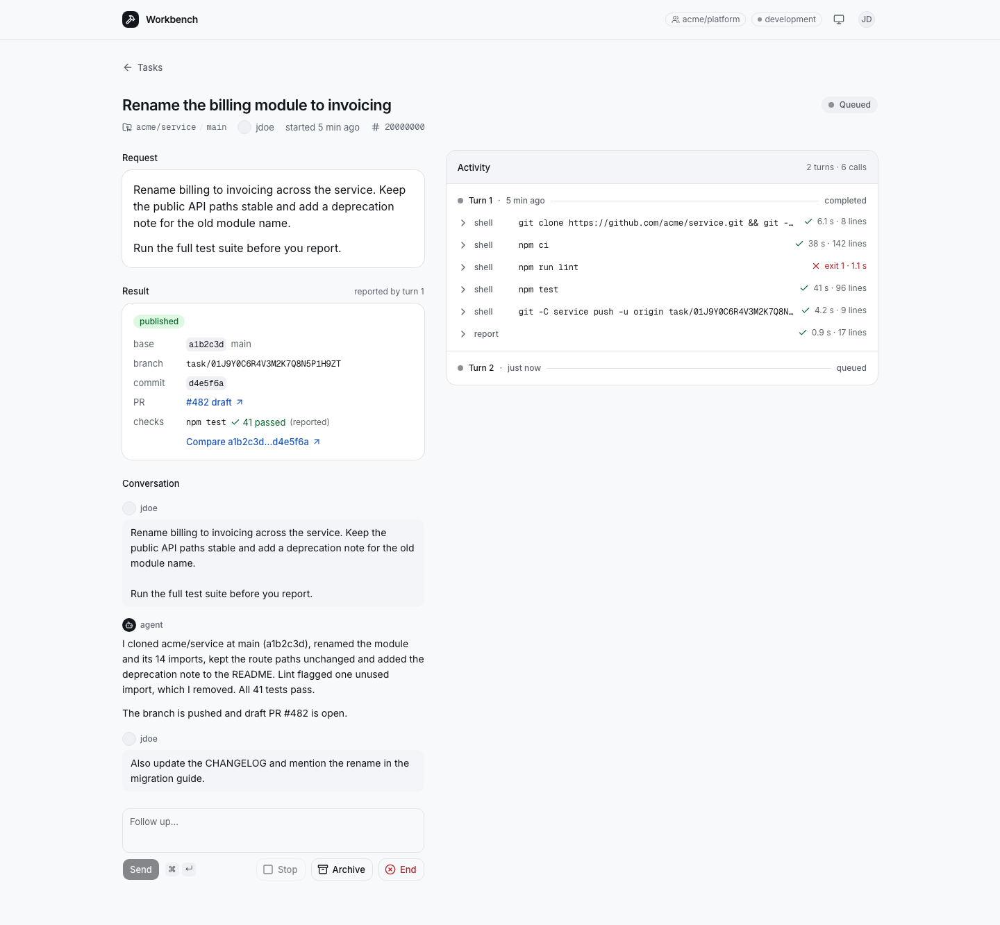

# OpenComputer Workbench

Hand off coding tasks and come back to pull requests. Pick a GitHub repository
and a starting revision. The agent clones it, makes the change, runs checks
and opens a draft PR. Follow up in the task to continue on the same branch,
or stop the current turn.

Built with one [OpenComputer Serverless Agent](https://docs.opencomputer.dev/agents/overview)
and a React web app. Each task is an OpenComputer session with its own
conversation and computer. Close the browser or redeploy the app while work
continues; reopen the session to see its commands and results.



## The worker

An agent is a TypeScript function: declare its capabilities and return its
instructions. Here is the [worker](opencomputer/agents/worker/agent.ts), with
imports omitted and task instructions shortened:

```ts
const github = defineConnection({
  id: "github",
  provider: githubApp({
    permissions: { contents: "write", pull_requests: "write" },
  }),
});

export default function Worker() {
  const task = readTask(useInput())?.task;
  useModel("anthropic/claude-sonnet-4.6");
  useConnection(github);
  useTool(report);

  return [
    task && `Work on ${task.repo} at ${task.ref}.`,
    "Clone the repo, make the change, run checks and open a draft PR.",
    "Use report to publish the branch, commit, PR and check outcomes.",
    "On follow-up, continue on the same branch and update the same PR.",
  ].filter(Boolean).join("\n");
}
```

OpenComputer runs the coding harness and provisions the computer. The GitHub
connection supplies credentials for `git` and `gh` on the repositories you
select. The harness handles the model/tool loop, conversation history and
coding tools.

The custom [`report` tool](opencomputer/agents/worker/tools/report.ts) declares
`result: true`: its output becomes the session's typed result. It verifies
commit, branch and PR references against GitHub; check outcomes remain
agent-reported. The UI renders those fields directly into the result card.

## The web app

Starting a task creates a session and sends its first turn. These are the
[task route's](src/server/tasks.ts) OpenComputer calls, with validation and
retry handling omitted:

```ts
const created = await oc.sessions.create(
  { deploymentId, environment, labels, source: "api" },
  { idempotencyKey: taskId },
);

await oc.sessions.turns.send(created.session.id, {
  input: text,
  payload: { taskId, repo, ref, actor },
  idempotencyKey: `${taskId}/start`,
  mode: "queue",
});
```

The task list comes from `oc.sessions.list()`. Session labels hold the title,
repository, requester and archive state; the session also carries its latest
result. There is no separate task database to keep in sync.

In the browser, [`useAgent`](https://docs.opencomputer.dev/agents/react)
attaches to that session:

```tsx
const { messages, turns, send, stop } = useAgent({
  sessionId,
  basePath: "/api/agent",
});
```

The hook loads the conversation and follows new activity; follow-ups and Stop
use the same session. [Authenticated Hono routes](src/server/session-proxy.ts)
check access and keep the OpenComputer key on the server. The
[Workers](src/hosts/workers.ts) and [Vercel](api/index.ts) adapters run that same
handler. Neither deployment needs an application database, queue or background
worker.

## Run it

You need Node.js 22:

```sh
git clone https://github.com/diggerhq/opencomputer-workbench.git
cd opencomputer-workbench
npm ci
```

Follow [setup](docs/setup.md) to deploy the agent, connect your repositories
and configure GitHub sign-in. Then run `npm run dev` and open
[localhost:3200](http://localhost:3200).

Start a task and wait for it to run. Stop the local web server, restart it,
and reopen the task. Review the draft PR, then ask for a follow-up such as
“cover the empty-input case too.” The agent updates the same PR.

To explore the UI with sample tasks first—no credentials required or live
agents started:

```sh
npx playwright install chromium
npm run dev:fixtures
```

These buttons deploy the web app; [set up the agent and access first](docs/setup.md#host-the-web-app).

[](https://deploy.workers.cloudflare.com/?url=https://github.com/diggerhq/opencomputer-workbench)
[](https://vercel.com/new/clone?repository-url=https%3A%2F%2Fgithub.com%2Fdiggerhq%2Fopencomputer-workbench&env=OPENCOMPUTER_API_KEY,OPENCOMPUTER_PROJECT_ID,OPENCOMPUTER_ENVIRONMENT,OPENCOMPUTER_AGENT_ID,GITHUB_CLIENT_ID,GITHUB_CLIENT_SECRET,WORKBENCH_COOKIE_KEY,WORKBENCH_MEMBERSHIP,WORKBENCH_ORIGIN)

Your deployment uses your OpenComputer project. Restrict sign-in to a GitHub
organization, team or single user. Members share all tasks and connected
repositories; there are no per-user repository permissions.
[Access details](docs/setup.md#access).

## Develop

`npm run check` runs typechecks, lint, unit tests and the build.
`npm run test:e2e` exercises the UI with Playwright.
`npm run deploy:agents` publishes the worker to Development independently of
the web app. See [AGENTS.md](AGENTS.md) for the source map and commands.
