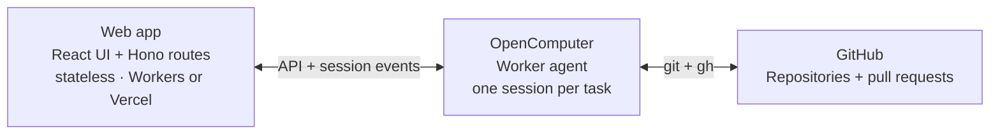

# OpenComputer Workbench

Hand off coding tasks and come back to pull requests. Pick a GitHub repository
and a starting revision. The agent clones it, makes the change, runs checks
and opens a draft PR. Follow up in the task to continue on the same branch,
or stop the current turn.

An example built on [OpenComputer Serverless Agents](https://docs.opencomputer.dev/agents/overview):
a **stateless web app** and one worker agent defined in TypeScript.


## How it fits together

The repository has two deployable parts: the web app and the worker agent.
An [OpenComputer agent](https://docs.opencomputer.dev/agents/reactive-agents)
is a TypeScript function that declares its model, tools and connections,
and returns instructions. The same agent definition serves many **sessions**,
one per coding task. OpenComputer runs the model/tool loop and provides each
session with a computer when needed.



OpenComputer stores the task metadata, conversation, activity and results;
GitHub holds the branches and PRs. The **web server keeps no task state** between
requests and needs no database, queue or background worker. You can restart
or redeploy it without interrupting tasks running on OpenComputer.

### Worker agent

The [worker agent](opencomputer/agents/worker/agent.ts) uses React-style hooks
to choose its model, connect GitHub and register a result tool. Imports are
omitted and task instructions shortened here:

```ts
const github = defineConnection({
  id: "github",
  provider: githubApp({
    permissions: { contents: "write", pull_requests: "write" },
  }),
});

export default function Worker() {
  const task = readTask(useInput())?.task;
  useModel("anthropic/claude-sonnet-4.6");
  useConnection(github);
  useTool(report);

  return [
    task && `Work on ${task.repo} at ${task.ref}.`,
    "Clone the repo, make the change, run checks and open a draft PR.",
    "Use report to publish the branch, commit, PR and check outcomes.",
    "On follow-up, continue on the same branch and update the same PR.",
  ].filter(Boolean).join("\n");
}
```

OpenComputer supplies the coding harness and tools. The declared GitHub
connection supplies credentials for `git` and `gh` on the repositories you select.

The custom [`report` tool](opencomputer/agents/worker/tools/report.ts) declares
`result: true`: its output becomes the session's typed result. It verifies
commit, branch and PR references against GitHub; check outcomes remain
agent-reported. The UI renders those fields directly into the result card.

### Web app

The app starts a task by creating a session of the deployed worker agent,
then sending its first turn. These are the [task route's](src/server/tasks.ts)
OpenComputer calls, with validation and retry handling omitted:

```ts
const created = await oc.sessions.create(
  { deploymentId, environment, labels, source: "api" },
  { idempotencyKey: taskId },
);

await oc.sessions.turns.send(created.session.id, {
  input: text,
  payload: { taskId, repo, ref, actor },
  idempotencyKey: `${taskId}/start`,
  mode: "queue",
});
```

The task list comes from `oc.sessions.list()`. Session labels hold the title,
repository, requester and archive state; the session also carries its latest
result. The task list and detail page both read from those sessions.

In the browser, [`useAgent`](https://docs.opencomputer.dev/agents/react)
attaches to that session:

```tsx
const { messages, turns, send, stop } = useAgent({
  sessionId,
  basePath: "/api/agent",
});
```

The hook loads the conversation and follows new activity; follow-ups and Stop
use the same session. [Authenticated Hono routes](src/server/session-proxy.ts)
check access and keep the OpenComputer key on the server. The
[Workers](src/hosts/workers.ts) and [Vercel](api/index.ts) adapters run that same
handler.

## Run it

### Prerequisites

- **Node.js 22**
- An **OpenComputer account** and organization API key
- An authenticated **[GitHub CLI](https://cli.github.com/)** (used to resolve the membership rule)

```sh
git clone https://github.com/diggerhq/opencomputer-workbench.git
cd opencomputer-workbench
npm ci
```

Follow [setup](docs/setup.md) to deploy the agent, connect your repositories
and configure GitHub sign-in. Then run `npm run dev` and open
[localhost:3200](http://localhost:3200).

Start a task and wait for it to run. Stop the local web server, restart it,
and reopen the task. Review the draft PR, then ask for a follow-up such as
"cover the empty-input case too." The agent updates the same PR.

To explore the UI with sample tasks first—no credentials required and no live
agents started:

```sh
npx playwright install chromium
npm run dev:fixtures
```

These buttons deploy the web app; [set up the agent and access first](docs/setup.md#host-the-web-app).

[](https://deploy.workers.cloudflare.com/?url=https://github.com/diggerhq/opencomputer-workbench)
[](https://vercel.com/new/clone?repository-url=https%3A%2F%2Fgithub.com%2Fdiggerhq%2Fopencomputer-workbench&env=OPENCOMPUTER_API_KEY,OPENCOMPUTER_PROJECT_ID,OPENCOMPUTER_ENVIRONMENT,OPENCOMPUTER_AGENT_ID,GITHUB_CLIENT_ID,GITHUB_CLIENT_SECRET,WORKBENCH_COOKIE_KEY,WORKBENCH_MEMBERSHIP,WORKBENCH_ORIGIN)

Your deployment uses your OpenComputer project. Restrict sign-in to a GitHub
organization, team or single user. Members share all tasks and connected
repositories; there are no per-user repository permissions.
[Access details](docs/setup.md#access).

## Develop

| Command | What it does |
| --- | --- |
| `npm run check` | Typechecks, lint, unit tests and build — what CI runs |
| `npm run test:e2e` | End-to-end UI tests with Playwright |
| `npm run dev` | Local dev server on port 3200 with hot reload |
| `npm run dev:fixtures` | Same server over sample fixtures, browser opened pre-signed-in |
| `npm run deploy:agents` | Publishes the worker to the Development environment |

See [AGENTS.md](AGENTS.md) for the full source map and all available commands.
