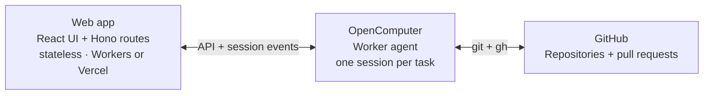

# OpenComputer Workbench

Hand off coding tasks and come back to pull requests. Pick a GitHub repository
and a starting revision. The agent clones it, makes the change, runs checks
and opens a draft PR. Follow up in the task to continue on the same branch,
or stop the current turn.

An example built on [OpenComputer Serverless Agents](https://docs.opencomputer.dev/agents/overview):
a **stateless web app** and one worker agent defined in TypeScript.


## How it fits together

The repository has two deployable parts: the web app and the worker agent.
An [OpenComputer agent](https://docs.opencomputer.dev/agents/reactive-agents)
is a TypeScript function that declares its model, tools and connections,
and returns instructions. The same agent definition serves many **sessions**,
one per coding task. OpenComputer runs the model/tool loop and provides each
session with a computer when needed.



OpenComputer stores the task metadata, conversation, activity and results;
GitHub holds the branches and PRs. The **web server keeps no task state** between
requests and needs no database, queue or background worker. You can restart
or redeploy it without interrupting tasks running on OpenComputer.

### Worker agent

The [worker agent](opencomputer/agents/worker/agent.ts) uses React-style hooks
to choose its model, connect GitHub and register a result tool. Imports are
omitted and task instructions shortened here:

```ts
const github = defineConnection({
  id: "github",
  provider: githubApp({
    permissions: { contents: "write", pull_requests: "write" },
  }),
});

export default function Worker() {
  const task = readTask(useInput())?.task;
  useModel("anthropic/claude-sonnet-4.6");
  useConnection(github);
  useTool(report);

  return [
    task && `Work on ${task.repo} at ${task.ref}.`,
    "Clone the repo, make the change, run checks and open a draft PR.",
    "Use report to publish the branch, commit, PR and check outcomes.",
    "On follow-up, continue on the same branch and update the same PR.",
  ].filter(Boolean).join("\n");
}
```

OpenComputer supplies the coding harness and tools. The declared GitHub
connection supplies credentials for `git` and `gh` on the repositories you select.

The custom [`report` tool](opencomputer/agents/worker/tools/report.ts) declares
`result: true`: its output becomes the session's typed result. It verifies
commit, branch and PR references against GitHub; check outcomes remain
agent-reported. The UI renders those fields directly into the result card.

### Web app

The app starts a task by creating a session of the deployed worker agent,
then sending its first turn. These are the [task route's](src/server/tasks.ts)
OpenComputer calls, with validation and retry handling omitted:

```ts
const created = await oc.sessions.create(
  { deploymentId, environment, labels, source: "api" },
  { idempotencyKey: taskId },
);

await oc.sessions.turns.send(created.session.id, {
  input: text,
  payload: { taskId, repo, ref, actor },
  idempotencyKey: `${taskId}/start`,
  mode: "queue",
});
```

The task list comes from `oc.sessions.list()`. Session labels hold the title,
repository, requester and archive state; the session also carries its latest
result. The task list and detail page both read from those sessions.

In the browser, [`useAgent`](https://docs.opencomputer.dev/agents/react)
attaches to that session:

```tsx
const { messages, turns, send, stop } = useAgent({
  sessionId,
  basePath: "/api/agent",
});
```

The hook loads the conversation and follows new activity; follow-ups and Stop
use the same session. [Authenticated Hono routes](src/server/session-proxy.ts)
check access and keep the OpenComputer key on the server. The
[Workers](src/hosts/workers.ts) and [Vercel](api/index.ts) adapters run that same
handler.

## Run it

You need Node.js 22, an OpenComputer account with an organization API key,
and an authenticated [GitHub CLI](https://cli.github.com/) to resolve the
membership rule.

```sh
git clone https://github.com/diggerhq/opencomputer-workbench.git
cd opencomputer-workbench
npm ci
```

To explore the UI with sample tasks first, with no credentials and no live
agents, run `npx playwright install chromium` once, then `npm run dev:fixtures`.

**Deploy the agent.** Sign in to OpenComputer, create and link a project,
then deploy the worker to its `development` environment:

```sh
npx opencomputer login
npx opencomputer link --create-project "Workbench"
npm run deploy:agents
```

The CLI writes the project and agent IDs to `.opencomputer/project.json`.
Then, in the OpenComputer dashboard, open the project's GitHub connection,
install the OpenComputer GitHub App, select the repositories the agent may
use, and **attach the installation to the Development environment**; an
installation alone does not make its repositories available. See
[GitHub connections](https://docs.opencomputer.dev/agents/github).

**Configure sign-in.** [Register a GitHub OAuth app](https://github.com/settings/applications/new)
with homepage `http://localhost:3200` and callback
`http://localhost:3200/auth/callback`; keep its client ID and secret. It
requests `read:org` for membership checks and gives the agent no repository
access. Then choose who can sign in, `user:YOUR_LOGIN`, `org:YOUR_ORG` or
`team:YOUR_ORG/TEAM_SLUG`, and resolve it once to numeric IDs so a later
rename does not change who is admitted:

```sh
npm run membership-id -- user:YOUR_LOGIN
```

**Start locally.** Copy `.env.example` to `.env.local` and fill it in: the
organization API key, the two IDs from `.opencomputer/project.json`,
`OPENCOMPUTER_ENVIRONMENT=development`, the OAuth app's client ID and
secret, the membership line, and a cookie key from `openssl rand -base64 32`.
The file is ignored by Git.

```sh
npm run dev
```

Open [localhost:3200](http://localhost:3200), sign in with GitHub and choose
a repository; an empty list means the installation is not attached to the
configured environment or has no repositories selected. Start a small task
and wait for it to run. Stop the local web server, restart it, and reopen
the task: its execution is on OpenComputer, the local server only serves
the UI and forwards authenticated requests. Review the draft PR, then ask
for a follow-up such as “cover the empty-input case too.” The agent updates
the same PR.

## Host the web app

Complete the agent and sign-in setup first, then use a button or deploy your
fork with the checked-in configuration: [`wrangler.jsonc`](wrangler.jsonc)
for Cloudflare Workers with the variables as Worker secrets, [`vercel.json`](vercel.json)
for Vercel with them as project environment variables.

[](https://deploy.workers.cloudflare.com/?url=https://github.com/diggerhq/opencomputer-workbench)
[](https://vercel.com/new/clone?repository-url=https%3A%2F%2Fgithub.com%2Fdiggerhq%2Fopencomputer-workbench&env=OPENCOMPUTER_API_KEY,OPENCOMPUTER_PROJECT_ID,OPENCOMPUTER_ENVIRONMENT,OPENCOMPUTER_AGENT_ID,GITHUB_CLIENT_ID,GITHUB_CLIENT_SECRET,WORKBENCH_COOKIE_KEY,WORKBENCH_MEMBERSHIP,WORKBENCH_ORIGIN)

Both serve `dist/client` (`npm run build`) and run the same Hono handler;
neither needs a datastore, queue or cron job. Set `WORKBENCH_ORIGIN` to the
deployed app's HTTPS origin and register `<origin>/auth/callback` on its
OAuth app. Deploying the web app does not deploy the agent; existing tasks
keep their pinned agent deployment.

## Access

Every admitted member sees and manages every task and can start agents with
write access to any repository attached to the configured environment; there
are no roles, and repository selection in the GitHub connection is the
boundary. Commits and PRs use the App's identity, with the requester
credited. The OpenComputer key stays on the server; sign-in state lives in
an encrypted cookie that expires 24 hours after sign-in and rechecks
membership hourly. Rotating `WORKBENCH_COOKIE_KEY` signs everyone out.

## Develop

`npm run check` runs typechecks, lint, unit tests and the build;
`npm run test:e2e` exercises every screen and state over recorded fixtures
with Playwright; `npm run deploy:agents` publishes the worker independently
of the web app. Everything auxiliary lives under `dev/`: tests, the visual
suite and its fixture replay, fixtures, design notes and captures, and the
tool configs. See [AGENTS.md](AGENTS.md) for the source map.
