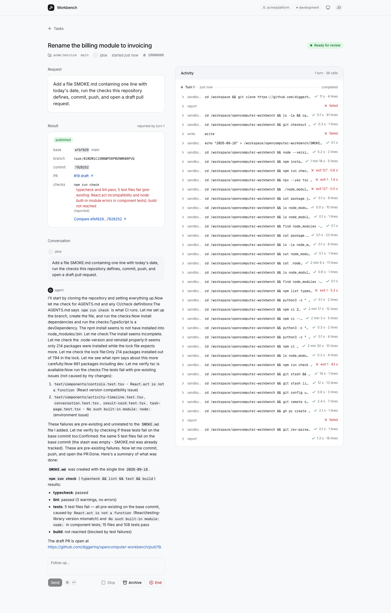

# OpenComputer Workbench

Pick a repository, describe a change, and leave it with a coding agent.
It clones the code, makes the change, runs checks and opens a draft PR.
Come back to inspect its commands, review the PR or ask for a follow-up on
the same branch.

This example pairs a TypeScript worker agent with a **stateless web app**.
[OpenComputer Serverless Agents](https://docs.opencomputer.dev/agents/overview)
runs the work and keeps its state, so you can close the browser—or redeploy
the app—while tasks continue.



## Components

- **Worker agent**, built on [OpenComputer Serverless Agents](https://docs.opencomputer.dev/agents/overview).
- **Web app**, built with TanStack Start and suitable for edge hosting, such as Cloudflare.

### Worker agent

Submitting a task creates an OpenComputer **session** running the worker
agent. An [agent](https://docs.opencomputer.dev/agents/reactive-agents) is a
TypeScript function that declares capabilities and returns instructions;
one deployed definition serves every task. Here is the
[worker agent](opencomputer/agents/worker/agent.ts), abridged:

```ts
export default function Worker() {
  useModel("anthropic/claude-sonnet-4.6");
  useConnection(github);
  useTool("shell");
  useTool("sandbox_exec");
  useTool("read");
  useTool("write");
  useTool("glob");
  useTool("grep");
  useTool(report);
  const task = readTask(useInput())?.task;

  return [
    task && `Work on ${task.repo} at ${task.ref}.`,
    "Clone, make the change, run checks, open a draft PR and report.",
    "Keep the same branch and PR for follow-ups.",
  ].filter(Boolean).join("\n");
}
```

OpenComputer runs the coding harness, starts a computer when needed and
supplies GitHub credentials through the declared connection. As the agent
works, its [`report` tool](opencomputer/agents/worker/tools/report.ts) saves
the branch, commit, reported checks and PR as the session's typed result.
That becomes the [result card](src/components/ResultCard.tsx) in the UI.

Change the model, tools or instructions in the worker, run `npm run check`,
then `npm run deploy:agents` to publish a new version to Development. The
app addresses the agent by name and environment; which version runs a task
is the platform's choice, recorded on the session, so tasks already started
keep theirs and new tasks get the new one. Agent deployments are independent
of web app releases.

### Web app

The app is one TanStack Start project: React screens and authenticated server
routes for sign-in and task controls. Its [task route](src/routes/api/tasks.ts)
creates sessions and reads the task list with `oc.sessions.list()`. Opening
a task attaches the UI to that session:

```tsx
const { messages, turns, send, stop } = useAgent({
  sessionId,
  basePath: "/api/agent",
});
```

[`useAgent`](https://docs.opencomputer.dev/agents/react) loads the conversation,
follows activity and sends follow-ups or Stop requests through
[authenticated routes](src/routes/api/agent/sessions.$id.$action.ts).
Task metadata, history and results stay on OpenComputer. The web server needs
no database, queue or background worker; each request can run in a fresh process.

## Quickstart

You need Node.js 22, the [GitHub CLI](https://cli.github.com/), and an
[OpenComputer account](https://app.opencomputer.dev) with credits and an
organization API key. This starts the web app locally; the agent runs on
OpenComputer.

### 1. Clone and install

```sh
git clone https://github.com/diggerhq/opencomputer-workbench.git
cd opencomputer-workbench
npm ci
cp .env.example .env.local
```

### 2. Deploy the worker agent

```sh
npx opencomputer login
npx opencomputer link --create-project "Workbench"
npm run deploy:agents
```

Linking replaces the repository's demo project binding with your own.
The updated `.opencomputer/project.json` contains the `projectId` and
`agentId` you will use below. The agent is now deployed to **Development**.

### 3. Connect a repository

Open your project in the OpenComputer dashboard and choose **GitHub**.
Install the managed OpenComputer GitHub App, select the repositories the
agent may use, and attach the installation to **Development**.

### 4. Configure app sign-in

Sign-in uses a separate [GitHub OAuth app](https://github.com/settings/applications/new).
Register one with homepage `http://localhost:3200` and callback
`http://localhost:3200/auth/callback`. Generate its client secret.

Sign in to the GitHub CLI with `gh auth login` if needed. Replace
`YOUR_LOGIN` with your GitHub username, then generate the membership setting
and cookie encryption key:

```sh
npm run membership-id -- user:YOUR_LOGIN
openssl rand -base64 32
```

Fill in `.env.local` using these values:

| Setting | Value |
| --- | --- |
| `OPENCOMPUTER_API_KEY` | Organization API key from the OpenComputer dashboard, for the organization owning your project |
| `OPENCOMPUTER_PROJECT_ID` | `projectId` from the updated `.opencomputer/project.json` |
| `OPENCOMPUTER_AGENT_ID` | `agentId` from that file |
| `GITHUB_CLIENT_ID`, `GITHUB_CLIENT_SECRET` | Your OAuth app's credentials |
| `WORKBENCH_MEMBERSHIP` | Copy the complete setting line printed by the membership helper |
| `WORKBENCH_COOKIE_KEY` | The generated base64 key |

Keep the supplied defaults: `OPENCOMPUTER_ENVIRONMENT=development` and
`WORKBENCH_ORIGIN=http://localhost:3200`. CLI login authenticates deployment;
the app reads its own API key from this file.

### 5. Start the app and hand off a task

```sh
npm run dev
```

Open [localhost:3200](http://localhost:3200), sign in with GitHub, choose a
repository and submit a change. The task page shows commands as they run,
then the reported result and draft PR. Send a follow-up to continue the task.
Once it is running, you can stop and restart the local server to try reconnecting.

The quickstart admits only your GitHub user. For a shared workbench, see
[organization and team access](docs/setup.md#access); admitted members share
all tasks and connected repositories.

## Host the app

Cloudflare is one hosting option; its configuration and deploy button are
included here. After the quickstart, [configure the hosted origin and secrets](docs/setup.md#host-the-web-app):

[](https://deploy.workers.cloudflare.com/?url=https://github.com/diggerhq/opencomputer-workbench)

<details>
<summary>Preview the UI without connecting accounts</summary>

After cloning and running `npm ci`, open the UI with sample tasks. No live
agents run:

```sh
npx playwright install chromium
npm run dev:fixtures
```

</details>

[Source map and development commands](AGENTS.md) · [MIT licensed](LICENSE).
