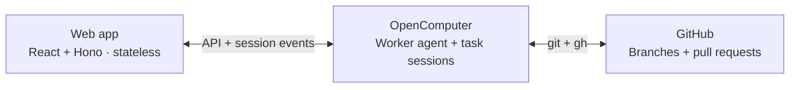

# OpenComputer Workbench

Pick a repository, describe a change, and leave it with a coding agent.
It clones the code, makes the change, runs checks and opens a draft PR.
Come back to inspect its commands, review the PR or ask for a follow-up on
the same branch.

This example is a **stateless web app** and a TypeScript worker agent.
[OpenComputer Serverless Agents](https://docs.opencomputer.dev/agents/overview)
runs the work and keeps its state, so you can close the browser—or redeploy
the app—while tasks continue.


## How it works



Submitting a task creates an OpenComputer **session** running the worker
agent. An [agent](https://docs.opencomputer.dev/agents/reactive-agents) is a
TypeScript function that declares capabilities and returns instructions;
one deployed definition serves every task. Here is the
[worker agent](opencomputer/agents/worker/agent.ts), abridged:

```ts
export default function Worker() {
  const task = readTask(useInput())?.task;
  useModel("anthropic/claude-sonnet-4.6");
  useConnection(github);
  useTool("shell");
  useTool("sandbox_exec");
  useTool("read");
  useTool("write");
  useTool("glob");
  useTool("grep");
  useTool(report);

  return [
    task && `Work on ${task.repo} at ${task.ref}.`,
    "Clone, make the change, run checks, open a draft PR and report.",
    "Keep the same branch and PR for follow-ups.",
  ].filter(Boolean).join("\n");
}
```

OpenComputer runs the coding harness, starts a computer when needed and
supplies GitHub credentials through the declared connection. As the agent
works, its [`report` tool](opencomputer/agents/worker/tools/report.ts) saves
the branch, commit, reported checks and PR as the session's typed result.
That becomes the result card in the UI.

The [web app](src/server/tasks.ts) reads the task list from
`oc.sessions.list()`. Opening a task attaches the React UI to its session:

```tsx
const { messages, turns, send, stop } = useAgent({
  sessionId,
  basePath: "/api/agent",
});
```

[`useAgent`](https://docs.opencomputer.dev/agents/react) loads the conversation,
follows activity and sends follow-ups or Stop requests through
[authenticated routes](src/server/session-proxy.ts). Task metadata, history
and results stay on OpenComputer. The web server needs no database, queue or
background worker; it can reconstruct the view from any fresh process.

## Run it

With Node.js 22:

```sh
git clone https://github.com/diggerhq/opencomputer-workbench.git
cd opencomputer-workbench
npm ci
```

Follow [setup](docs/setup.md) to deploy the worker agent, connect your
repositories and configure sign-in. Then run `npm run dev` and open
[localhost:3200](http://localhost:3200).

To preview the UI first, with sample tasks and no credentials required:

```sh
npx playwright install chromium
npm run dev:fixtures
```

The same web app runs on Workers or Vercel. Complete
[agent and access setup](docs/setup.md#host-the-web-app) before deploying:

[](https://deploy.workers.cloudflare.com/?url=https://github.com/diggerhq/opencomputer-workbench)
[](https://vercel.com/new/clone?repository-url=https%3A%2F%2Fgithub.com%2Fdiggerhq%2Fopencomputer-workbench&env=OPENCOMPUTER_API_KEY,OPENCOMPUTER_PROJECT_ID,OPENCOMPUTER_ENVIRONMENT,OPENCOMPUTER_AGENT_ID,GITHUB_CLIENT_ID,GITHUB_CLIENT_SECRET,WORKBENCH_COOKIE_KEY,WORKBENCH_MEMBERSHIP,WORKBENCH_ORIGIN)

Use your own OpenComputer project and restrict sign-in to a GitHub user, team
or organization. Admitted members share all tasks and connected repositories.
[Access details](docs/setup.md#access) · [Source map and development commands](AGENTS.md).
